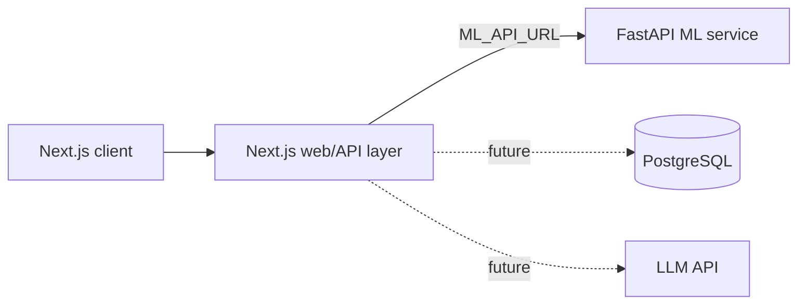

# ML Lab

ML Lab is an interactive experimentation platform that helps people upload tabular data, compare machine-learning models, inspect errors, and understand results in plain English.

> Screenshot / demo GIF placeholder

> Live demo placeholder

## Phase 1 status

This repository provides end-to-end tabular experiments: CSV inspection, target/task selection, and fair comparisons between linear/logistic regression, Random Forest, and Gradient Boosting with a leakage-safe 80/20 split. Additional model families, storage, and AI explanations are deliberate later phases.

## Architecture



The ML service is separate so Vercel can host the web product while longer-running Python workloads can be deployed to a suitable container host. The web layer will use `ML_API_URL`, avoiding provider-specific coupling.

## Repository layout

```text
web/          Next.js App Router frontend
ml-service/   FastAPI machine-learning service
```

## Local development

### Web

```bash
cd web
npm run dev
```

### ML service

```bash
cd ml-service
python -m venv .venv
source .venv/bin/activate
pip install -r requirements.txt
uvicorn app.main:app --reload
```

Visit `http://localhost:8000/health` to confirm the service is healthy.

## API (Phase 1)

`GET /health`

```json
{ "status": "healthy", "service": "ml-service" }
```

`POST /dataset/analyze` accepts a CSV upload and returns dataset dimensions, missing-value counts, detected column types, target candidates, and a safe 15-row preview. The service enforces 10 MB, 50,000-row, and 100-column limits.

`POST /experiment/run` accepts a CSV, target column, problem type, and model list. It uses a consistent reproducible split, fits preprocessing only on training rows, and returns each model's real test metrics.

Planned endpoint: `POST /predict`.

## ML pipeline roadmap

The next phase validates CSVs and returns a dataset preview. The first complete training slice will support linear/logistic regression. Preprocessing will be fitted on training data only to prevent leakage, and later models will share a `BaseMLModel` interface via a factory.

## Testing

```bash
cd ml-service
pytest
```

## Deployment

Deploy `web/` to Vercel. Build and deploy `ml-service/` from its Dockerfile to a container host, then set `ML_API_URL` in the web environment. Do not commit secrets; use `.env.example` as the key reference.

## Future improvements

- CSV inspection and robust validation
- Regression and classification experiment pipeline
- Model comparison, error analysis, and feature importance
- PostgreSQL-backed saved experiments and authentication
- Grounded AI explanations using structured experiment results
